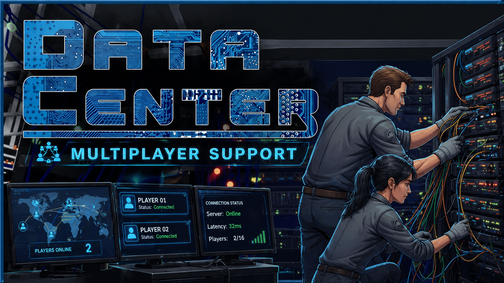

<p align="center">
  
</p>

<p align="center">
  
  
  
  
  
  
</p>

# Data Center — Multiplayer Mod

Unofficial multiplayer mod for **Data Center** (by Waseku, Steam AppID `4170200`).
Built on top of [MelonLoader](https://melonwiki.xyz/) for IL2CPP and the game's
existing Steamworks.NET integration.

> 🚧 **This is a work in progress.**
> The mod is under active development and **not feature-complete**. Wire formats,
> hotkeys, and on-disk layout may change between any two versions before `0.1`.
> Both peers must run the **exact same** version — joining a host on a different
> mod version is detected and surfaced as a banner in the HUD, but full
> compatibility is not guaranteed.
>
> Lobby + transport + transform / economy / customer-pool / server-placement
> replication is validated end-to-end with two real Steam users. Cables,
> switches, patch panels, customer-base assignments, and client save
> suppression are **not** implemented yet — see "What's replicated / what
> isn't" below.

## What's replicated (host → peers)

- **Steam lobby** (FriendsOnly, max 4 members) with create / join / leave /
  invite-overlay flows. Host advertises lobby metadata (`dcmp_version`,
  `dcmp_host_name`, `dcmp_workshop`); peers auto-accept session requests
  from lobby members. Joining client warns when the host's mod version or
  Workshop subscription set differs from its own (banner in HUD + log).
- **P2P transport** over `SteamNetworkingMessages` on three channels
  (control, state, event). Reliable + unreliable send paths, RX/TX stats
  in HUD. `F5` toggles a debug loopback that also dispatches `Broadcast`
  to local handlers for solo round-trip testing.
- **Remote player avatars** — coloured capsule per peer at their world-space
  position, smoothed at 20 Hz. `F7` warps you to the first remote peer.
- **Authority model** — `Networking/Authority.cs` is the single source of
  truth for "am I the authoritative peer". Harmony patches in
  `Patches/ClientSuppression.cs` block AutoSave, `ShuffleAvailableCustomers`,
  and Player money/XP/reputation updates on non-host peers so the
  simulation can't run in parallel. `F6` toggles `ForceClient` for solo
  testing of the suppression path.
- **Economy sync** — host broadcasts `(money, xp, reputation)` at 1 Hz,
  client writes the values directly. Combined with the suppression
  patches, client numbers track the host instead of drifting or freezing.
- **Customer pool sync** — `MainGameManager.availableCustomerIndices` is
  pushed to clients on join, on every host shuffle, and on every customer
  choice. Clients mirror the same set of cards in their customer-choice
  canvas. Both peers share the same `customerItems` source array
  (deterministic data), so an int list alone is enough to reproduce the
  visible pool.
- **Cross-peer event log** — host's significant actions (server power /
  place / break / repair, switch power / place, customer chosen) emit
  human-readable events that show up on every peer's HUD as a notification
  stack with timestamps.

## What's *not* replicated yet

- **Entity placements** (servers, switches, patch panels, cables, racks).
  Each peer still loads their own save, so the world geometry is whatever
  was on disk. The capsule shows where the host *would* be standing in
  their world, mapped onto your coordinates.
- **Customer base assignments** — which customer is hosted in which base.
  The pool is in sync, but the chosen-card-to-base step isn't replicated.
- **Client-side intents.** Clients can't act on the host's world — buying,
  toggling power, connecting cables on a client doesn't propagate back.
- **External Steam invites** (`+connect_lobby <id>` from launch args). In-
  game overlay invites work via `GameLobbyJoinRequested_t`; the launch-
  argument path isn't parsed yet.

## Layout

```
Tools/
├─ DCMultiplayer.Mod/        the actual MelonMod (net6.0)
│   ├─ Mod.cs                  entry point, hotkeys, OnUpdate dispatch
│   ├─ ModInfo.cs              version + name (single source of truth)
│   ├─ Networking/
│   │   ├─ SteamLobby.cs       Steam Matchmaking wrapper + callbacks
│   │   ├─ Transport.cs        SteamNetworkingMessages send/recv
│   │   └─ Authority.cs        IsHost / IsClient / IsAuthoritative
│   ├─ Replication/
│   │   ├─ NetMsg.cs           wire format (PlayerPose, EconomyTick, EventText)
│   │   ├─ PlayerSync.cs       20 Hz pose broadcast (sender)
│   │   ├─ RemotePlayers.cs    capsule avatars (receiver)
│   │   ├─ EconomySync.cs      1 Hz money/xp/rep broadcast + apply
│   │   ├─ EventLog.cs         cross-peer text notifications
│   │   └─ CustomerPoolSync.cs replicate availableCustomerIndices
│   ├─ Networking/
│   │   ├─ SteamLobby.cs       Matchmaking + lobby callbacks +
│   │   │                        version/Workshop mismatch detection
│   │   ├─ Transport.cs        SteamNetworkingMessages send/recv
│   │   │                        (+ DebugLoopback for solo testing)
│   │   ├─ Authority.cs        IsHost / IsClient / IsAuthoritative
│   │   └─ WorkshopManifest.cs enumerate StreamingAssets/Mods/workshop_*
│   ├─ Patches/
│   │   ├─ Observers.cs        read-only logging patches (debug)
│   │   ├─ ClientSuppression.cs  prefix patches that no-op the sim on clients
│   │   └─ HostEvents.cs       host-side patches that emit EventLog +
│   │                           drive CustomerPoolSync.BroadcastCurrent
│   └─ UI/Hud.cs               IMGUI overlay (status panel + event stack +
│                                 mismatch banners + copy-id button)
│
├─ DCInstaller/              single-file self-contained installer (net8.0)
│                              embeds the built mod DLL, runs the <>O fix,
│                              deploys to <Game>/Mods/.
│
├─ DCFixCore/                standalone variant of the <>O fix (dev tool)
│
├─ DCInspect/                Mono.Cecil-based dumper for Assembly-CSharp.dll
│                              (resolve real method signatures during dev)
│
├─ Tests/DCMultiplayer.Mod.Tests/   xunit round-trip tests for NetMsg
│                              (no game deps, runs in CI)
│
├─ docs/CLAUDE.md            running technical briefing — what's known about
│                              the game's IL2CPP surface, Phase A/B/C/D plan,
│                              gotchas, hotkeys, current status
│
├─ scripts/release.ps1       cut a release: rebuild, zip, tag, push
├─ .github/workflows/        CI (test on push/PR, release shell on tag)
│
├─ README.md                 this file
├─ LICENSE                   MIT
└─ .gitignore
```

## Building

Requirements:

- A Steam install of **Data Center**.
- **MelonLoader 0.7.2** installed on it via the
  [official installer](https://github.com/LavaGang/MelonLoader.Installer/releases).
- The game launched at least once via Steam so MelonLoader has generated the
  IL2CPP proxy assemblies under `<Game>/MelonLoader/Il2CppAssemblies/`.
- **.NET 8 SDK**.

The simplest setup is to clone this repo as `<Game>/Tools/` so the MSBuild
defaults pick up the right `GameDir`:

```sh
cd "<Steam>/steamapps/common/Data Center"
git clone https://github.com/andrediashexa/datacenter-multiplayer.git Tools
cd Tools/DCMultiplayer.Mod
dotnet build -c Release
```

The build copies `DCMultiplayer.dll` into `<Game>/Mods/`.

To clone elsewhere, point each project at the game folder explicitly:

```sh
dotnet build -c Release -p:GameDir="C:\Path\To\Data Center"
```

`DCFixCore` and `DCInspect` accept the path via `DC_GAME_DIR` environment
variable or first CLI argument.

## Distributing

```sh
cd Tools/DCInstaller
dotnet publish -c Release
# -> bin/Release/net8.0/win-x64/publish/DCMultiplayer-Installer.exe
```

The single-file installer:

1. Locates Data Center via Steam library scan (or accepts a path argument).
2. Verifies MelonLoader is present.
3. Applies the `<>O` TypeDef fix to `UnityEngine.CoreModule.dll`
   ([LavaGang/MelonLoader#1142](https://github.com/LavaGang/MelonLoader/issues/1142)),
   keeping a `.bak` of the original.
4. Drops `DCMultiplayer.dll` into `<Game>/Mods/`.

Send the resulting `.exe` to a peer; it self-extracts and needs no .NET
runtime on the target machine.

### Cutting a release

The mod itself can't be built in CI — `Il2CppAssemblies/*.dll` are generated
locally by MelonLoader on a Data Center install and aren't redistributable.
So releases are built locally and published via a small helper script:

```pwsh
# 1. Bump ModInfo.Version + commit + push
# 2. Run from anywhere inside the repo:
pwsh ./scripts/release.ps1 0.0.9
```

The script:
- refuses to release from a dirty working tree or a non-`main` branch
- refuses if `ModInfo.Version` doesn't match the requested version
- clean-rebuilds the mod, publishes the single-file installer, packages
  `dist/DCMultiplayer-v<version>-win-x64.zip`
- tags `v<version>`, pushes the tag

`.github/workflows/release.yml` then opens the GitHub release shell with
notes pulled from the tag annotation and the latest commit body. Upload
the `.zip` to that release page (drag-and-drop in the UI, or
`gh release upload v0.0.9 dist/DCMultiplayer-v0.0.9-win-x64.zip`).

## Hotkeys (in-game)

| Key | Action |
|-----|--------|
| `F5` | Toggle `Transport.DebugLoopback` (debug — local round-trip dispatch) |
| `F6` | Toggle `Authority.ForceClient` (debug — testing suppression solo) |
| `F7` | Warp local player to the first remote avatar |
| `F8` | Host a Friends-Only Steam lobby |
| `F9` | Leave the current lobby |
| `F10` | Dump member list to the MelonLoader console |
| `F11` | Open Steam's Invite Friends overlay |
| `F12` | Broadcast a `PING` (debug round-trip test) |

## Credits / third-party

- [MelonLoader](https://github.com/LavaGang/MelonLoader) — IL2CPP modding host.
- [Il2CppInterop](https://github.com/BepInEx/Il2CppInterop) — managed proxy
  assemblies for IL2CPP types.
- [Mono.Cecil](https://github.com/jbevain/cecil) — assembly rewriter used by
  the `<>O` fix.
- [FixCoreModule](https://github.com/V1ndicate1/FixCoreModule) by V1ndicate1 —
  the Cecil-based TypeDef stripping logic is adapted from this project under
  MIT.
- [Steamworks.NET](https://github.com/rlabrecque/Steamworks.NET) by
  Riley Labrecque — the wrapper Data Center already ships with, which the mod
  reuses for lobby/networking calls.

## License

MIT — see [LICENSE](LICENSE).
